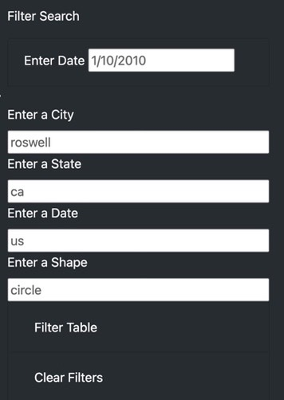

# UFOs
Using JavaScript, HTML & CSS

# OVERVIEW
The purpose of this project is to create a dynamic webpage where a user can filter UFO sightings data based on:
  date
  city
  state
  country
  shape

# RESULTS
See below steps on how to use the website:
  1. In the Filter Search section, filter the data based on
    date
    city
    state
    country
    shape
  2. Then click the "Filter Table" button
  3. Click the "Clear Filter" button to clear the filters and get the placeholder data

# SUMMARY 
In summary, one drawback of the webpage is the clear filters button does not clear the placeholder text content.

# Recommendations for further development
  1. Remove placeholder text from fields
  2. Remove placeholder data from showing
